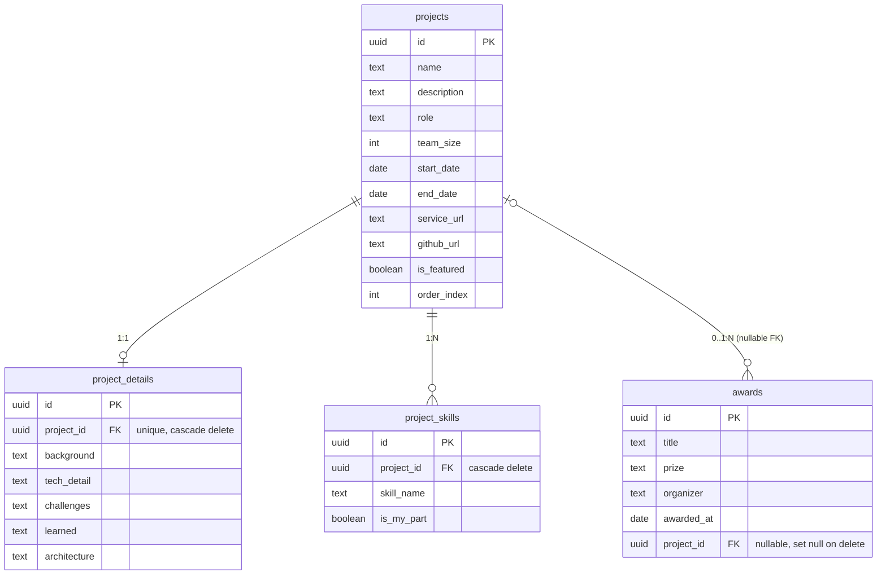

# 데이터 모델

> 이 문서는 [`supabase/schema.sql`](../supabase/schema.sql) 을 사람이 읽기 좋게 풀어쓴 설명입니다.
> **스키마의 원본(source of truth)은 항상 `schema.sql`** 이며, 둘이 어긋나면 `schema.sql` 이 맞습니다.
> 둘 다 반드시 같이 갱신하세요.

## 설계 철학: Data-Driven Design (DDD)

이 프로젝트는 화면(컴포넌트/페이지)을 먼저 만들고 데이터를 끼워맞추는 방식이 아니라,
**Supabase의 테이블 구조를 먼저 확정하고, 사이트의 모든 화면·콘텐츠가 그 데이터를 그대로 반영**하는
방식으로 설계됩니다.

- 새 콘텐츠 요구사항이 생기면 → 먼저 테이블/컬럼을 어떻게 바꿀지 결정 → `schema.sql` 갱신 → 화면 반영
- 화면에 "이 필드가 필요할 것 같다"는 이유만으로 임의 필드를 추가하지 않음 (실제 데이터 필요성이 확인된 뒤 추가)

### 새 테이블을 추가할 때 체크리스트

1. `alter table ... enable row level security;`
2. 필요한 `create policy` (공개 읽기 / authenticated 쓰기 등)
3. **`grant` 문 추가** — 이 프로젝트는 Supabase의 "Automatically expose new tables"를 꺼둔 상태라
   RLS 정책만으로는 부족하고 테이블 단위 `grant select/insert/update/delete ... to anon, authenticated;`
   를 명시적으로 추가해야 Data API가 동작함 ([[decisions#adr-006]])
4. `src/types/database.ts` 에 대응 타입 추가
- 사이트 코드는 데이터를 **조회(read-only)** 하는 역할만 하며, 데이터의 진짜 주인은 Supabase 테이블

관련 문서: [[architecture]] · [[decisions]] · [[content-operations]]

## ERD

`skills`, `experiences`, `contacts` 는 다른 테이블과 FK 관계 없는 독립 테이블입니다.

## 테이블별 설명

### `projects` — 프로젝트 기본 정보
목록/카드 뷰에 노출되는 요약 정보. 현재 대상 프로젝트: **Fithub, Dartoo, 내일의 나**.

| 컬럼 | 의미 |
|---|---|
| `description` | 목록에서 보이는 한줄 설명 (상세 설명은 `project_details` 로 분리) |
| `end_date` | `null` = 진행 중인 프로젝트 |
| `is_featured` | 메인 화면 노출 여부 |
| `order_index` | 노출 순서 수동 제어 |

### `project_details` — 프로젝트 상세 (1:1)
프로젝트 상세 페이지 전용 데이터. `projects` 에 인라인 컬럼으로 넣지 않고 **별도 테이블로 분리**한 이유는
[[decisions#adr-003]] 참고. `project_id` 에 `unique` 제약이 걸려 있어 프로젝트당 상세 레코드는 정확히 0 또는 1개.

| 컬럼 | 의미 |
|---|---|
| `background` | 기획 배경 / 프로젝트를 시작한 동기 |
| `tech_detail` | 기술적 구현 상세 |
| `challenges` | 어려웠던 점 & 해결 방법 |
| `learned` | 배운 점 |
| `architecture` | 아키텍처 설명(텍스트) 또는 이미지 URL |

### `project_skills` — 프로젝트별 기술 스택 (1:N)
프로젝트 하나에 여러 기술 스택을 매핑. `is_my_part` 로 "팀 프로젝트에서 본인이 직접 담당한 기술"과
"팀에서 쓰였지만 본인 담당은 아닌 기술"을 구분.

### `awards` — 수상 내역
`project_id` 는 **nullable FK, `on delete set null`**. 수상이 특정 프로젝트에서 비롯된 경우도 있고
(예: 해커톤 수상작이 곧 포트폴리오 프로젝트) 그렇지 않은 경우도 있어 선택적 관계로 설계됨
([[decisions#adr-004]]). 프로젝트 레코드가 삭제돼도 수상 이력 자체는 보존됨.

### `skills` — 전체 기술 스택 (소개 섹션)
`project_skills` 와는 별개로, 자기소개/스킬 섹션에 노출되는 전체 기술 목록. `category` (Language /
Framework / Database / DevOps / Tools) 와 `level` (main / sub) 로 강조 여부를 표현.

### `experiences` — 활동/학회
`type` 값: `club`(학회/동아리) · `intern`(인턴) · `activity`(기타 대외활동). `end_date` 가 `null` 이면
진행 중.

### `contacts` — 문의 폼 수신함
사이트 방문자가 남기는 문의를 저장하는 인박스. `is_read` 로 확인 여부 관리. RLS 상 **누구나 insert 가능,
조회는 본인만** — 사이트에서 쓰기(insert)가 허용되는 유일한 테이블.

## 미해결/TODO

- [x] `projects` / `project_details` / `project_skills` 의 실제 시드 데이터 (Fithub, Dartoo, 내일의 나) 작성
- [x] 기존 `awards` 시드 데이터의 `project_id` 를 실제 프로젝트와 연결 (Dartoo ← 최우수상, 내일의 나 ← 우수상)
- [ ] 이미지 업로드(프로젝트 썸네일, 아키텍처 다이어그램 등) — Supabase Storage 버킷 설계 필요 (미착수)
- [ ] Fithub / 내일의 나 `project_details.architecture` 는 아직 텍스트 설명이 짧음 — 다이어그램 이미지는 Storage 설계 후 추가 예정
